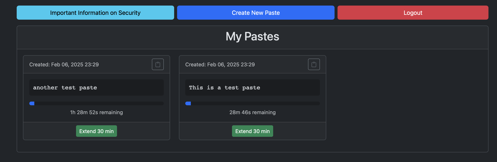

# Copy Paste Service

A locally hosted Django-based temporary paste service similar to pastebin. It allows users to store text snippets that automatically expire after 30 minutes.

The core goal of this service is to be able to copy and paste text between Windows and iOS/Android Devices, platforms without a native shared clipboard.

From a security prospective, this is designed to be run on a Kubernetes cluster in a HomeLab. Before deploying be sure to read the Security section.



## Security

It is important to know that all pastes are stored in plaintext. This means that direct database access would allow you to read the pastes.

Due to this, this service is not intended to be run somewhere that has ingress from the internet and was built for a home lab use where there should be less concern for the security risks.

This is slightly mitigated by deleting records in the database after 30 minutes, but that obviously means that the data is vulnerable for those 30 minutes.

However, it would still be best to avoid pasting sensitive data like passwords.

## Features

- Stores text that the user wants to share between devices
- Automatically delete notes after 30 minutes
- Account system which all notes are associated with. Each user is only able to see their notes

## How It Works

### Paste Lifecycle

1. When the user creates a paste, a a 30 minute expiration time is set on the paste. This is stored as a specific expiration timestamp not a time from creation.
2. A user can extend the expiration time in 30 minute intervals. If the expiration time is already an hour or more in the future it won't extend anymore. This means that the max expiration time from the current time is 1 hour 29 minutes and 59 seconds.
The time however can be extended again once it is under an hour.
3. After the expiration time, a cronjob will delete expired pastes from the database. This cron runs every minute so there is technically up to a 60 second window that a note will show as "expired" in the UI and is not yet deleted.

**Note:** The UI purposefully does not hide expired pastes to avoid giving a false sense of security if there is something broken with the cron job to delete pastes. 

## Technical Stack

- Python 3.12
- Django 5.0+
- PostgreSQL 17.2
- Bootstrap 5

## Kubernetes Deployment

TODO: This section will be writen after this has been open sourced. Waiting for the github pages to be configured and the docker repository.

## Local Development

Docker Compose handles creating the database, generating migrations, applying migrations, running the tests, and finally running the service.

It will also run the script to delete old records once instead of on cron.

1. Clone the repository:
   ```bash
   git clone <repository-url>
   cd copy_paste
   ```

2. Start the application using Docker Compose:
   ```bash
   docker compose up -d
   ```

3. Access the application at http://localhost:8001

## License

See [LICENSE](./LICENSE).

## Test Coverage
Current results of the test coverage:
```
| ---------- coverage: platform linux, python 3.12.9-final-0 -----------
| Name                                Stmts   Miss  Cover   Missing
| -----------------------------------------------------------------
| copy_paste/__init__.py                  0      0   100%
| copy_paste/settings.py                 28      1    96%   14
| copy_paste/urls.py                     11      1    91%   10
| copy_paste/wsgi.py                      4      4     0%   10-16
| manage.py                              11     11     0%   3-22
| pastes/__init__.py                      0      0   100%
| pastes/apps.py                          4      0   100%
| pastes/forms.py                        13      0   100%
| pastes/migrations/0001_initial.py       7      0   100%
| pastes/migrations/__init__.py           0      0   100%
| pastes/models.py                        9      0   100%
| pastes/urls.py                          3      3     0%   1-4
| pastes/views.py                        50      1    98%   56
| tests/test_models.py                   23      0   100%
| tests/test_urls.py                     38      0   100%
| tests/test_views.py                    90      0   100%
| -----------------------------------------------------------------
| TOTAL                                 291     21    93%
```

## Future Improvements

Some improvements I am thinking about implementing:

- Configure functionality in Admin
   - The main reason many of the features below have not yet been implemented is because I feel like someone deploying this will likely not want some of these features and just want the basics
   - We should have the ability to enable and disable features in admin (requires implementing the admin panel and make it so a user can be setup as admin)
   - Should be more than just enabling and disabling core features but also functionality for features. Example:
      - Like changing the expiration time, max expiration time, extend time
      - if the security risk confirmation is implemented the ability to enable or disable the quiz
      - Other functionality
- Ensure the user understands security risks
   - It is possible that some users (if shared with others at home) may not read this document to understand the security risks or may not understand what is in this document
   - Right now there is a modal that can be viewed that will explain some security concerns, however it may be worth cleaning this up so an average technical user can better understand
   - The button to view this modal should also be on the create paste page where it is especially critical
   - However to better ensure the user really understands the risks, could make it so before the user can create pastes they are required to read the security concerns and click a button confirming reading. It would be important that the security concerns are quick to read so it is not just skipped.
   - Could even make it so a quick "quiz" is required confirming the user really understands. Nothing complicated, but better than nothing
- Better handling of special pastes, ideally without the user needing to specify the type of note
   - Code formatting
   - Links being links, opening in a new tab
- Sharing a note with another user
   - Sometimes a user may want to share a note with someone else instead of between their devices. They should be able to allow another user to see specific notes. The same expiration rules should still run as they do now.
   - Only the authenticated user that owns the note should be able to extend (or delete if that functionality is implemented)
- Public Notes?
   - Not fully sure about this particular functionality but it could be valuable to add the ability to make public notes that require no authentication to view.
   - This obviously carries a security risk so unsure if it should be implemented or if it would even be useful.
   - If this was implemented these would just show on the login page with the same look as when logged in. When logged in you should also be able to see public notes
   - Only the authenticated user that owns the note should be able to extend (or delete if that functionality is implemented)
- Manually deleting a note
- Never expiring notes?
   - there may be some value of being able to make a never expiring note
   - Doing so has an obvious security concern and this should be clearly communicated to the user
   - This should not be implemented until the ability to manually delete a note is implemented
   - Will complicate possible implementation details of recovering accounts
- Stats: I think it would be interesting to create a stats page showing the usage. Things like:
   - Number of users
   - Number of current notes
   - Historical number of notes (this will require changes to the database and at this time would not include information from before implementation)
- Real time validation of username and password during signup
- Account Management Improvements
   - Right now there is no functionality to recover an account or change password
   - Password change should be implemented
   - Unsure yet how recovery will work
      - There is no email system associated with this so no ability to send a recovery email
      - Due to the ephemeral nature of the service, it is possible that "recovery" could just work by giving the ability to delete an account without logging in. Allowing it to be re-created
      - A safety net for this could be to make it so this only works if an account has no active notes
